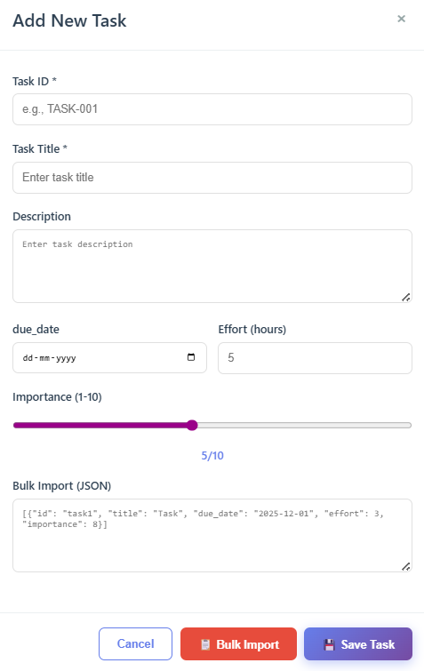
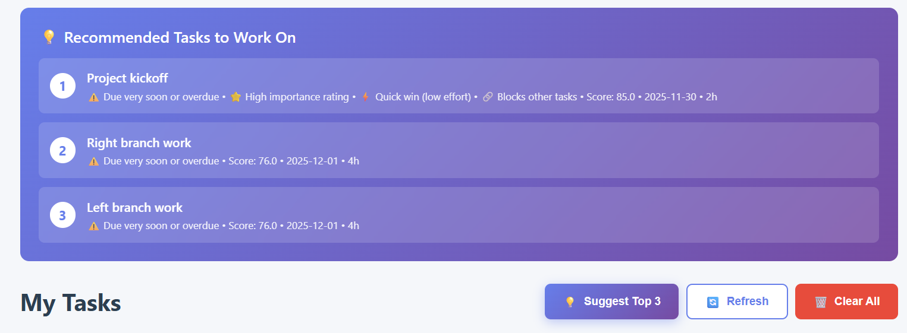
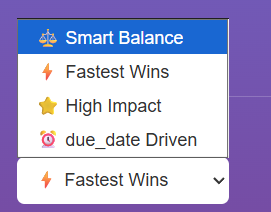

# Task Manger.exe your ultimate task scheduler !!

## Setup Instructions

Follow these steps to set up and run the application:

1.  **Clone the repository:**

    ```bash
    git clone https://github.com/grittyuser007/smart_taskmanger.git
    ```

2.  **Navigate to the project directory:**

    ```bash
    cd smart_taskmanager
    ```

3.  **Backend Setup:**

    ```bash
    cd backend
    pip install -r requirements.txt  # Install requirements
    python manage.py makemigrations  # Create migration files
    python manage.py migrate         # Apply migrations to database
    python manage.py runserver 8000  # Start the backend
    ```

4.  **Frontend Setup:**
    Open a new terminal window:

    ```bash
    cd ..
    cd frontend
    python -m http.server 8001       # Run frontend at port 8001
    ```

5.  **Running Tests:**
    To run the comprehensive testing suite:
    ```bash
    cd backend
    python manage.py test            # Runs 25 total tests covering all algorithms
    ```

---

## UI Demonstration

The application features a modern, user-friendly interface for managing and prioritizing tasks. Below are screenshots demonstrating the key features:

### Main Interface


_The main dashboard showing the task list with priority scores and color-coded indicators_

### Adding Tasks


_Modal dialog for adding new tasks with all required fields (ID, description, due date, importance, effort, dependencies)_

### Suggested Tasks


_Top 3 recommended tasks based on the selected strategy with explanations_

### Strategy Selection


_Four different prioritization strategies: Smart Balance, Fastest Wins, High Impact, and Deadline Driven_

---

## Algorithm Description

The Smart Task Analyzer uses a multi-factor scoring system. It helps users identify priority tasks. It does not rely on a single metric. Instead, it combines four dimensions into a score between 0 and 100. The core philosophy is that priority is contextual. A task due tomorrow may not be the most critical. A long task blocking others might be more urgent. The algorithm weighs multiple factors to capture this.

### The Four Scoring Components

#### 1. Urgency Score (Max 40 Points)

Urgency measures time sensitivity. It is the most heavily weighted component. The calculation uses an exponential decay curve. This reflects human psychology regarding deadlines. The system mirrors this perception.

- **Overdue Tasks (40 pts):** These receive maximum urgency but are capped to prevent inflation.
- **Due Today (38 pts):** The window is closing fast, so urgency is near-maximum.
- **Due in 1-2 Days (33-35 pts):** This range requires immediate attention.
- **Due in 3-5 Days (25-30 pts):** These are approaching urgency.
- **Due in 6-10 Days (15-20 pts):** These are medium-term tasks.
- **Due in 11-15 Days (10-15 pts):** These tasks have breathing room.
- **Due Beyond 15 Days (<10 pts):** Minimal urgency score.
- **No Due Date (10 pts):** Default score for "someday" tasks.

**Note:** The system uses working days. It accounts for holidays if enabled. Weekends do not count as available work time. This is configured for Indian holidays by default but supports over 100 countries.

#### 2. Importance Score (Max 30 Points)

This represents subjective value. Users rate tasks from 1 to 10. The algorithm scales this linearly to 30 points. This counts for 30% of the total score. User judgment is important but should not override objective factors. The 30-point cap ensures balance.

- **Linear Scaling:** Rating 8 is twice as important as rating 4.
- **Default:** Missing ratings default to 15 points (neutral). This prevents artificial boosting of tasks.

#### 3. Effort Score (Max 15 Points)

This uses an inverse relationship. Tasks requiring less time get higher scores. This implements the "quick wins" philosophy.

- **0-1 Hours (15 pts):** Maximum score for quick wins.
- **1-2 Hours (12 pts):** Completed in one sitting.
- **2-4 Hours (9 pts):** Medium effort.
- **4-8 Hours (6 pts):** Substantial effort.
- **8+ Hours (3-5 pts):** Large tasks receive lower scores.

Completing small tasks builds momentum. It clears cognitive overhead. Long tasks often hide complexity. Quick wins improve velocity metrics. However, large, critical tasks will still score highly overall. Missing estimates default to 7.5 points.

#### 4. Dependency Score (Max 15 Points)

This identifies bottleneck tasks. The algorithm counts how many tasks depend on the current one.

- **Zero Dependents (5 pts):** Baseline score.
- **One Dependent (8 pts):** Creates a small cascading effect.
- **Two Dependents (11 pts):** The task is becoming a bottleneck.
- **Three+ Dependents (15 pts):** Critical path task.

Unblocking work is a force multiplier. It allows for better parallelization. The system detects circular dependencies using depth-first search. It warns the user but still scores the tasks.

### Strategy System

The algorithm supports four preset strategies:

1.  **Smart Balance (Default):** All factors are weighted equally (1.0x).
2.  **Fastest Wins:** Effort is doubled (2.0x). Urgency (0.5x) and Importance (0.7x) are reduced. Use this to build momentum.
3.  **High Impact:** Importance is emphasized (2.5x). Effort (0.3x) and Urgency (0.6x) are reduced. Use this for strategic work.
4.  **Deadline Driven:** Urgency is maximized (2.5x). Use this for crisis mode.

---

## Design Decision's

The current algorithm has some limitations worth acknowledging. It doesn't consider task dependencies beyond the immediate one-hop relationship. It can't account for resource constraints, team member availability, or varying productivity levels throughout the day. It treats all work as equally interruptible.

It is important to understand the requirements were to make a fixed input value to output some priority score, so a fixed algorithm that was explained above, was implemented. Minimal requirements are fulfilled to include error checking and handling. Time constraints were considered to use a fixed algorithm approach, more time and if a training corpus was available an ml model based on inputs could have sufficed with better scores.

---

## Time Breakdown

### Backend Development (4 hours 45 minutes)

**Algorithm Design & Planning (45 mins)**

- Researched priority scoring.
- Sketched four-factor system.
- Decided on point allocations (40-30-15-15).
- Planned exponential urgency curve.
- Designed strategy multipliers.
- Mapped edge cases.

**Core Scoring Logic (1 hour)**

- Implemented `TaskScorer` class.
- Built urgency, importance, effort, and dependency calculations.
- Implemented strategy weight system.
- Added support for multiple field naming conventions.

**Dependency Management (45 mins)**

- Implemented reverse lookup map.
- Built circular dependency detection (DFS).
- Debugged traversal logic.
- Handled empty dependency arrays.

**API Endpoints (2 hours)**

- Created `analyze_tasks` and `suggest_tasks` views.
- Built endpoints for adding tasks and marking done.
- Added `health_check` and error handling.

**Holiday Intelligence Bonus (15 mins)**

- Integrated holidays library.
- Modified urgency to exclude non-working days.
- Configured for Indian holidays.

### Unit Testing (45 minutes)

**Test Suite Development (45 mins)**

- Wrote 20+ comprehensive unit tests.
- Covered edge cases for urgency and importance.
- Tested effort inverse relationships.
- Verified circular dependency detection.
- Tested all strategy variations and sorting logic.

### Frontend Development (1 hour 45 minutes)

**HTML Structure (30 mins)**

- Designed two-column layout.
- Created task input forms and bulk JSON area.
- Built strategy selector buttons.

**CSS Styling (30 mins)**

- Implemented modern card design.
- Added responsive grids and color-coded indicators.
- Styled buttons and loading states.

**JavaScript API Integration (45 mins)**

- Implemented `addTask` and `loadBulkTasks`.
- Created `analyzeTasks` logic.
- Built dynamic result display and visualizations.

### Documentation (~ 1 hour)

**README Writing (50 mins)**

- Wrote setup instructions.
- Created algorithm explanation.
- Documented design decisions and ranges.
- Described strategies and edge cases.

**Future Improvements Section (10 mins)**

- Listed potential enhancements.
- Estimated complexity.

### Testing & Debugging (2 hours+)

**Integration Testing (1 hr 30 mins)**

- Tested endpoints with Postman.
- Verified dependency detection.
- Tested frontend-backend communication.

**Bug Fixes (40 mins+)**

- Fixed field name mapping.
- Resolved ID mismatch issues.
- Corrected response formats.

---

## Bonus Attempts

1.  Dependency flag and drawing the graph of the dependencies via the use of bfs graphs.
2.  Data Intelligence considers the holidays and the weekends as the consideration and ranks it accordingly using the holidays package in python to check for holidays and then rank them accordingly.
3.  Creating unit tests to handle the error cases, 25 such tests to check all error handling in the application.

---

## Future Improvements

1.  Training a well defined dynamic ml model with correspondence to the user history, which automatically trains based on the user's capacity to do tasks and how early he completes them.
2.  Inter task dependencies and understanding of the task intent or description to better prioritize if a user ranks it incorrectly. Current model is just using a fixed value based calculation algorithm, future scopes can be implementation of ml/generative agents to calculate scores even accurately as per each user.
3.  Chatbot based interface to add/retrieve tasks and rank automatically can extremely improve productivity.
